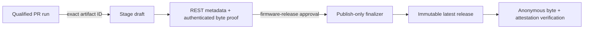

# Firmware release process

AMBIT releases use the application, bootloader, partition table, OTA data init,
and manifest produced by the qualified pull-request run. The release workflow
does not rebuild firmware. For ticket 21 it is intentionally pinned to v1.1.4,
PR 4, and operator-recorded PR head, Actions run, artifact, and application
SHA-256 values.

## One-time repository setup

Before merging the release-triggering change, an administrator must:

1. Enable release immutability in the repository settings. It applies only to
   subsequently published releases.
2. Create the Actions environment `firmware-release`, restrict it to `main`, and
   configure the required reviewers who authorize the single draft-to-published
   transition.
3. Allow GitHub Actions to create releases with the repository `GITHUB_TOKEN`.
4. Set these repository Actions variables from the already-qualified PR run:

   | Variable | Required value |
   | --- | --- |
   | `AMBIT_V114_PR_HEAD_SHA` | Full 40-character lowercase hexadecimal head SHA of the qualified PR 4 run |
   | `AMBIT_V114_PR_RUN_ID` | Numeric ID of the successful `.github/workflows/pr.yml` run at the pinned PR head |
   | `AMBIT_V114_ARTIFACT_ID` | Numeric ID of that run's live `firmware-${AMBIT_V114_PR_HEAD_SHA}` artifact |
   | `AMBIT_V114_APP_SHA256` | Lowercase SHA-256 of `ambit-fw-v1.1.4.bin` from that artifact |

The workflow fails if any value is missing or if GitHub says the artifact came
from another run, workflow, event, conclusion, or PR head. It never selects an
artifact by creation time.

## Staging boundary

The staging job first requires semantic-release's preview to be exactly 1.1.4
and requires both `v1.1.4` tag and release to be absent. It downloads the pinned
artifact ID, checks the exact five-file allowlist and manifest offsets, sizes,
and SHA-256 values, and separately requires the application hash above.

The repository pins `@semantic-release/github` to 11.0.6 with
`draftRelease: true`. PR CI executes its installed `lib/publish.js` with a
mocked Octokit and proves that it creates a draft, uploads assets, and issues no
publication PATCH. The same test executes `lib/success.js` and proves the later
success phase does not publish the draft. Semantic-release is invoked only in
the staging job. The exact npm tarball inspected for this qualification has
registry SHA-1 `3320c373334858a3aefb11cf75abccb7cc438040`, archive SHA-256
`4bd998c6530867151587e99ca8abb7ede0d1e51904195f8945caf2d1eed22554`, and
registry integrity
`sha512-ctDzdSMrT3H+pwKBPdyCPty6Y47X8dSrjd3aPZ5KKIKKWTwZBE9De8GtsH3TyAlw3Uyo2stegMx6rJMXKpJwJA==`.

After staging, the job verifies the lightweight tag target, stable draft
metadata, the exact five REST asset records (IDs, labels, timestamps, sizes,
and server SHA-256 digests), manifest agreement, and authenticated asset
downloads. It uploads only a proof record for the protected finalizer; it does
not publish the draft.

## Protected finalizer

After environment approval, the finalizer downloads the staging proof and
revalidates the still-draft release, tag, unchanged REST records, and
authenticated bytes. It sends exactly one GitHub REST update with
`draft=false` and `make_latest=true`. It does not invoke semantic-release,
build firmware, upload assets, or create/move a tag.

The finalizer then requires GitHub to report the same release as immutable,
stable, and latest. Asset IDs, creation/update timestamps, sizes, and digests
must remain identical to the staging proof. Finally, anonymous downloads must
hash to the proved values and `gh release verify` / `gh release verify-asset`
must validate GitHub's immutable-release attestations.

An existing tag, existing release or draft, duplicate/ambiguous API record,
proof drift, failed publication response, missing immutability, or byte mismatch
stops the workflow. Do not rerun semantic-release to repair a partial stage;
inspect the draft/tag and resolve the exceptional state manually before any new
release attempt.

For a later firmware version, update the one-shot version/tag/qualification
pins and repository variables in a reviewed release-process change before its
qualified artifact is published.
